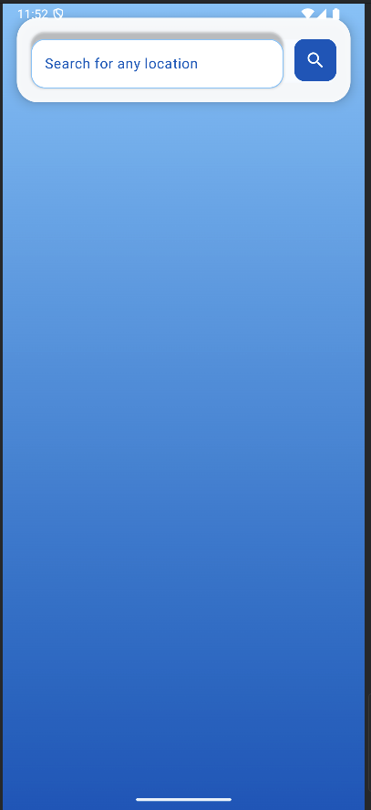

# 🌦️ Weather App (Jetpack Compose + MVVM)

A beautifully designed **Weather Forecast App** built using **Jetpack Compose**, modern Android architecture, and Kotlin. This app fetches real-time weather data and displays it with a minimal UI and smooth user experience.

---

## 📱 Features

- 🌍 Get real-time weather updates
- 📍 Fetch location-based forecast (City/Area)
- 🌡️ Temperature, humidity, wind, etc.
- 🕒 Shows current, max, and min temperatures
- 📊 Clean UI with Jetpack Compose
- ⚙️ MVVM architecture with Retrofit (if used)

---

## 🛠️ Tech Stack

| Tool/Library       | Purpose                      |
|--------------------|------------------------------|
| 🧠 Kotlin           | Language                     |
| 🎨 Jetpack Compose | UI Toolkit                   |
| 🧰 ViewModel       | Lifecycle-aware UI Logic     |
| 📡 Retrofit/Volley | API Calls (if used)          |
| 🌐 OpenWeatherMap  | Weather API (optional)       |
| ☁️ Coroutines      | Async programming            |
| 🧪 LiveData/State  | Reactive state management    |

---

## 🧑‍💻 Architecture

Follows **MVVM (Model-View-ViewModel)** pattern:

UI (Jetpack Compose)
↓
ViewModel (handles data)
↓
Repository (API / Local)
↓
Weather API (e.g., OpenWeatherMap)


---

## 🚀 Getting Started

1. **Clone this repo**:

```bash
git clone https://github.com/Manoj19636/Weather-App.git
cd Weather-App

    Open in Android Studio

    (REQUIRED) Add your weather API key in Constants.kt 

    Run on emulator or device

📸 Screenshots

   
    

🔐 API Configuration (Optional)

If you're using an API like OpenWeatherMap:

    Go to: https://openweathermap.org/api

    Sign up and get your API key

    Place it in a Constants.kt file like:

const val API_KEY = "your_api_key_here"

📂 Folder Structure

WeatherApp/
├── data/
│   └── model, api
├── ui/
│   └── screens, theme
├── viewmodel/
│   └── WeatherViewModel.kt
├── MainActivity.kt

💡 Future Features

    📍 Auto-detect current location

    🌤️ Hourly & Weekly forecast

    🎨 Custom theme switcher (Light/Dark)

    🔔 Weather alerts & notifications

🙋‍♂️ Author

Manoj Kumar
📫 GitHub
⭐ Like this project?

If you found it useful, star this repo ⭐ and share it with others!
📄 License

This project is licensed under the MIT License


---

Would you like me to save this into a `README.md` file you can directly upload or commit to your repo?

